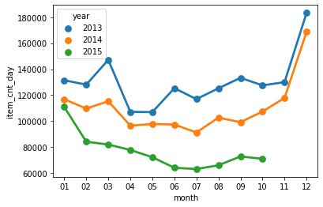
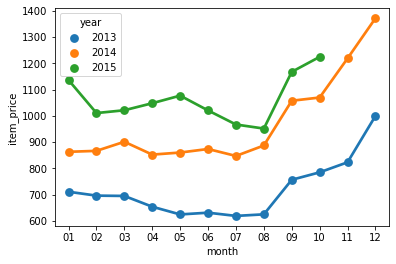
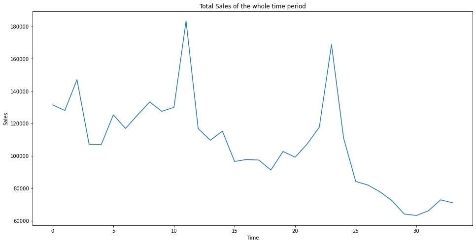

# FUTURE-SALES-PREDICTION-
challenging time-series dataset consisting of daily sales data, kindly provided by one of the largest Russian software firms - 1C Company. 
to predict total sales for every product and store in the next month. By solving this  you will be able to apply and enhance your data science skills.
# LIBRARIES USED 
import pandas as pd
from datetime import datetime
import numpy as np
import matplotlib.pyplot as plt
import seaborn as sns

%matplotlib inline
from keras.models import Sequential
from keras.layers import LSTM,Dense,Dropout
from keras.models import load_model, Model
i have imported these libaries for this problem ............

# THESE-ARE-CSV-FILES-USED-
items = pd.read_csv('items.csv')
    item_cats = pd.read_csv('item_categories.csv')
    shops = pd.read_csv('shops.csv')
    sales = pd.read_csv('sales_train.csv')
    test = pd.read_csv('test.csv')
    submission = pd.read_csv('sample_submission.csv')
# DISPLAY SALES AND USING TIME SERIES ANALYSIS    

I USED -------    sales['year'] = pd.to_datetime(sales['date']).dt.strftime('%Y')      (((((Series.dt.strftime(*args, **kwargs)[source]
Convert to Index using specified date_format.))))))

Return an Index of formatted strings specified by date_format, which supports the same string format as the python standard library. Details of the string format can be found in python string format doc.

sales['month'] = sales.date.apply(lambda x: datetime.strptime(x,'%d.%m.%Y').strftime('%m'))  --------------APPLYING DATETIME FORMAT
sales.head(2) -----------------------------------to display 2 changed column in sales

# CREATING TIME SERIES GRAPH OF 2013,2014,2015
grouped = pd.DataFrame(sales.groupby(['year','month'])['item_cnt_day'].sum().reset_index())
sns.pointplot(x='month', y='item_cnt_day', hue='year', data=grouped)

#Price
grouped_price = pd.DataFrame(sales.groupby(['year','month'])['item_price'].mean().reset_index())
sns.pointplot(x='month', y='item_price', hue='year', data=grouped_price)

/////after this graph is printed in output i came to conclusion By seeing this graph we can see that

1)last two months of the year having more sales. 
2)2015, we are expecting more sales.

# i created this code creating time series graph name total sales of the whole time period
ts = sales.groupby(['date_block_num'])['item_cnt_day'].sum()
ts.astype('float')
plt.figure(figsize=(16,8))
plt.title('Total Sales of the whole time period',color='yellow')
plt.xlabel('Time',color='yellow')
plt.ylabel('Sales',color='yellow')
plt.plot(ts, color='green');

